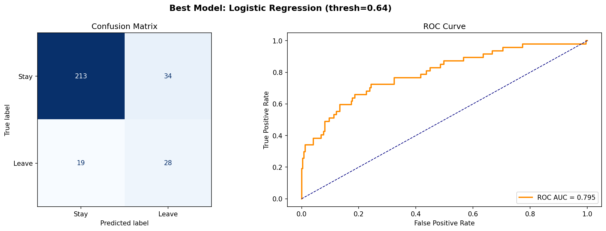
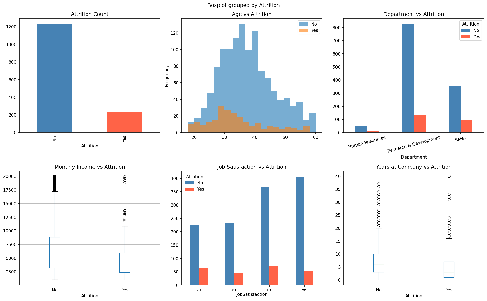
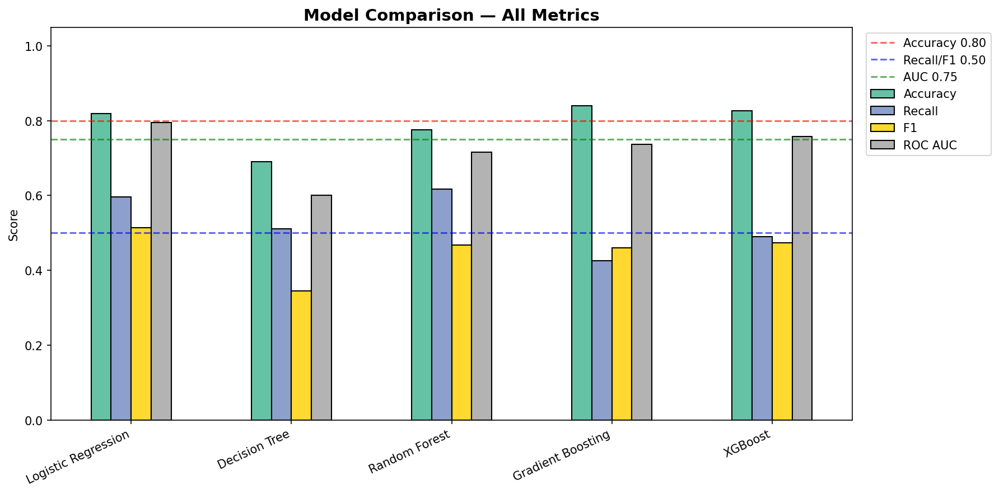

#  HR Attrition Intelligence Dashboard

> An end-to-end Machine Learning project to predict and visualize employee attrition using the IBM HR Analytics dataset — featuring a fully interactive, single-file analytics dashboard.



---

##  Project Overview

Employee attrition costs organizations millions annually. This project builds a **complete ML pipeline** — from raw data to a polished, interactive analytics dashboard — to identify *who* is leaving, *why*, and *which model* best predicts it.

Built as part of an ML/AI program project, this demonstrates the full lifecycle:
`Data → EDA → Feature Engineering → Model Training → Evaluation → Dashboard`

---

## 🗂️ Project Structure

```
HR-PROJECT/
│
├── 📊 hr_dashboard_pro.html          ← Interactive analytics dashboard (single-file)
├── 🐍 hr_attrition_pipeline.py       ← Main ML pipeline script
├── 🐍 universal_hr_pipeline_v3.py    ← Universal pipeline (handles multiple datasets)
│
├── 📁 Data/
│   ├── WA_Fn-UseC_-HR-Employee-Attrition.csv   ← IBM HR dataset (main)
│   ├── train.csv                                ← Train split
│   └── test.csv                                 ← Test split
│
├── 📄 results.json                   ← Pipeline output (fed into dashboard)
│
└── 📸 Outputs/
    ├── eda_plots.png                 ← Exploratory Data Analysis charts
    ├── model_comparison.png          ← Multi-model metric comparison
    └── best_model_evaluation.png     ← Best model evaluation plots
```

---

##  Tech Stack

| Layer | Tools Used |
|---|---|
| **Language** | Python 3.x |
| **ML Libraries** | scikit-learn, pandas, numpy |
| **Visualization (Python)** | matplotlib, seaborn |
| **Dashboard** | HTML5, CSS3, JavaScript, Chart.js |
| **Dataset** | IBM HR Employee Attrition |

---

##  ML Pipeline

### Models Trained & Compared
- Logistic Regression
- Decision Tree
- Random Forest 
- Gradient Boosting
- Support Vector Machine (SVM)

### Evaluation Metrics
| Metric | Target |
|---|---|
| Accuracy | ≥ 80% |
| Recall | ≥ 50% |
| F1 Score | ≥ 50% |
| ROC AUC | ≥ 75% |

### Key Steps
1. **EDA** — Attrition by department, age, income, tenure, overtime
2. **Preprocessing** — Label encoding, SMOTE for class imbalance (if needed)
3. **Feature Engineering** — Selected top predictors based on importance scores
4. **Model Training** — 5-Fold Cross Validation with threshold tuning
5. **Output** — `results.json` with all metrics + chart data for dashboard

---

##  Dashboard Features

The `hr_dashboard_pro.html` is a **zero-dependency, single-file interactive dashboard** that:

-  Accepts `results.json` via drag & drop upload
-  Renders 10+ interactive Chart.js visualizations
-  Shows attrition breakdown by department, age, income, tenure, role, OT & marital status
-  Compares 5 ML models side-by-side
-  Highlights top feature importances
-  Elegant light-theme editorial design

**To run:** Simply open `hr_dashboard_pro.html` in any browser → upload `results.json`

---

##  How to Run

```bash
# 1. Clone the repo
git clone https://github.com/YOUR_USERNAME/hr-attrition-intelligence.git
cd hr-attrition-intelligence

# 2. Install dependencies
pip install pandas numpy scikit-learn imbalanced-learn matplotlib seaborn

# 3. Run the pipeline
python hr_attrition_pipeline.py

# 4. Open the dashboard
# Open hr_dashboard_pro.html in browser → upload the generated results.json
```

---

##  Screenshots

| EDA Analysis | Model Comparison |
|---|---|
|  |  |

---

##  Key Insights

- **Overtime** employees show significantly higher attrition risk
- **Early tenure** (< 1 year) is the highest-risk group
- **Single employees aged 18–25** in low-income roles are most likely to leave
- **Overtime, Monthly Income, and Job Level** are top predictors across models

---

##  About

Built by **Rishva** as part of the **ML/AI Program**
Demonstrating: End-to-end ML pipeline · Feature engineering · Model evaluation · Frontend dashboard development

---

##  Connect

[](https://www.linkedin.com/in/rishva-davariya-1a609b372)
[](https://github.com/AI-RISHVA)

---

> ⭐ Star this repo if you find it useful!